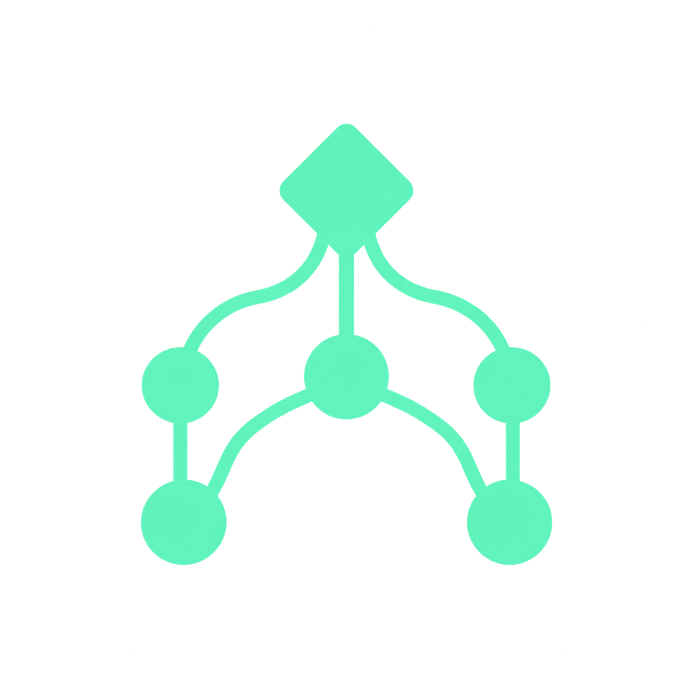
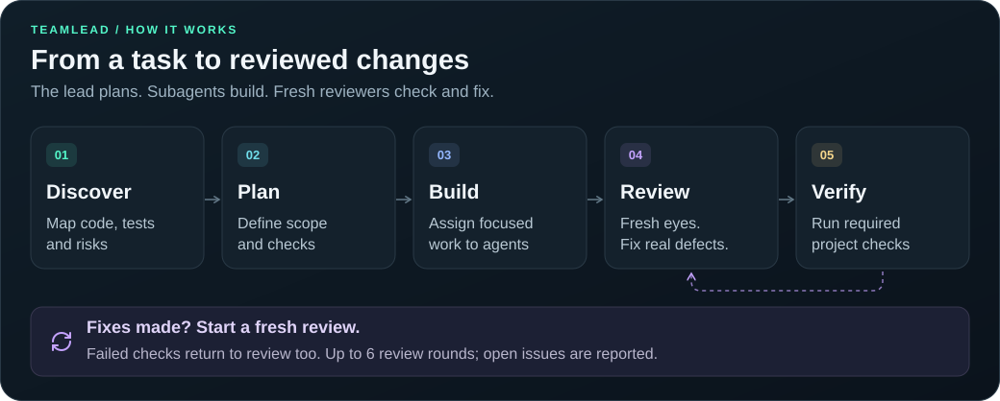

<p align="center">
  
</p>

<h1 align="center">teamlead</h1>

<p align="center">
  <strong>Plan. Delegate. Review independently.</strong><br>
  One skill for Codex and Claude Code.
</p>

<p align="center">
  <a href="README.ru.md"></a>
</p>

<p align="center">
  <a href="skills/teamlead/references/codex/workflow.md"></a>
  <a href="skills/teamlead/references/claude/workflow.md"></a>
  <a href="#install"></a>
</p>

<p align="center">
  <a href="#install">Install</a> &nbsp;·&nbsp;
  <a href="#how-it-works">How it works</a> &nbsp;·&nbsp;
  <a href="#use">Usage</a> &nbsp;·&nbsp;
  <a href="#codex-models">Codex models</a> &nbsp;·&nbsp;
  <a href="#claude-code-models">Claude Code models</a>
</p>

---

Give Teamlead a task. The lead studies the codebase, makes a plan, and assigns scoped work to subagents. Fresh reviewers check and fix the changes; the lead closes with the project's required checks and a report of what actually passed.

## Install

Requires Git and Node.js 22.20+ with npm. Run in your terminal:

```sh
npx skills add BorzDev/teamlead
```

**Applications → Global / Project → install.** The wizard includes the `Universal` group with Codex; select Claude Code as well if needed.

<details>
<summary><strong>How the installation wizard works</strong></summary>

The [Skills CLI](https://github.com/vercel-labs/skills) wizard handles installation:

1. Finds the single `teamlead` skill and selects it automatically.
2. Includes `Universal` applications, including Codex, automatically. Add Claude Code with Space and confirm with Enter. The application step may be skipped when only one application is detected.
3. Offers `Project` for the current project or `Global` for all of the user's projects.
4. May offer `Symlink / Copy`, then shows a summary for confirmation.

For a project installation, run the command from the project root. No GitHub login or manual clone is needed. The profile is selected when the skill runs, so you can install for both applications at once.

For Claude Code only, specify the application explicitly:

```sh
npx skills add BorzDev/teamlead -a claude-code
```

| Environment | Global (default path) | Project | Invocation |
| --- | --- | --- | --- |
| Codex | `~/.agents/skills/teamlead/` | `.agents/skills/teamlead/` | `$teamlead <task>` |
| Claude Code | `~/.claude/skills/teamlead/` | `.claude/skills/teamlead/` | `/teamlead <task>` |

Symlink mode shares one skill copy between applications. The application list comes from Skills CLI; this skill includes working profiles for Codex and Claude Code.

</details>

## How it works

<p align="center">
  
</p>

| Stage | What happens |
| --- | --- |
| **01 · Discover** | A scout maps the relevant code, tests, and risks. The lead reads the findings and saves the starting Git state. |
| **02 · Plan** | The lead defines the goal, file ownership, interfaces, and checks for each task. Planning mode stops here. |
| **03 · Build** | Subagents implement assigned tasks and run focused checks. Work runs in parallel only when its files and resources do not overlap. |
| **04 · Review & fix** | A fresh reviewer inspects the changes and fixes real defects. Every round that makes fixes is followed by another fresh review. |
| **05 · Verify** | After a clean review, the required project checks run in sequence. A failed check goes back to review and repair. |

**A clear finish:** the review cycle requires a round with zero findings and a `ready` verdict. It is capped at six rounds; unfinished checks and open issues are reported explicitly.

**A record you can inspect:** the plan, decisions, worker reports, and review results are saved outside the repository, separately for each checkout and run. The final handoff lists changes, review rounds, actual check results, and anything still unresolved. Saved state lets the lead continue after context compaction.

## Use

One entry point, two application profiles. Teamlead selects the tools and models of the current Codex or Claude Code session. The bundled workflow instructions are in Russian.

Run the workflow in a Git repository with at least one commit: the profiles use `HEAD` to record the baseline.

**Codex:** select **Astra / Ultra** in the main session, then send:

```text
$teamlead Add search filters and verify the result
```

**Claude Code:** select **Fable 5.1 / max** in the main session, then send:

```text
/teamlead Add search filters and verify the result
```

To start a new terminal session with this model and effort:

```sh
claude --model claude-fable-5-1 --effort max
```

To stop after planning, append the supported phrase `только план`.

### Codex models

| Role | Model | Effort |
| --- | --- | --- |
| Lead: planning and decisions | `gpt-6-astra` | `ultra` |
| Main implementation | `gpt-5.6-terra` | `high` |
| Independent review | `gpt-5.6-sol` | `high` |
| Narrow searches and simple edits | `gpt-5.6-luna` | `medium` |
| Money, authorization, complex migrations, concurrency | `gpt-5.6-sol` | `xhigh` |

Requires a Codex environment with `collaboration` tools and per-agent model/effort selection. The skill does not change the main session's model. See the [Codex profile](skills/teamlead/references/codex/workflow.md) for the full rules.

### Claude Code models

Requires **Claude Code 2.1.267+**, **Dynamic workflows enabled**, access to **Fable 5.1**, and provider support for the requested Fable and Opus effort levels, including Opus `xhigh`. On Pro, you may need to enable Dynamic workflows in `/config` yourself. See the official [workflow documentation](https://code.claude.com/docs/en/workflows).

| Role | Model | Effort |
| --- | --- | --- |
| Lead: planning and decisions | `claude-fable-5-1` | `max` |
| Narrow searches and simple edits | `opus` | `medium` |
| Scouting unfamiliar code | `opus` | `high` |
| Main implementation | `opus` | `high` |
| Independent review and fixes | `opus` | `high` |
| Money, authorization, complex migrations, concurrency — implementation and review | `opus` | `xhigh` |
| Running already specified check commands | `opus` | `low` |
| Escalation of an individual subtask | `claude-fable-5-1` | `max` |

Set the lead's model and effort yourself. The skill does not switch the main session or edit settings. Every subagent runs through native `Workflow`, with an explicit `agent(prompt, { model, effort })` call using its role's settings. If `Workflow` is unavailable, the profile stops before scouting and reports the missing requirement; it does not fall back to `Agent` with inherited effort.

These are requested effort levels. Model and provider limits, runtime caps, and environment overrides can constrain them. The profile reports unavailable levels or overrides instead of claiming the requested setting took effect. See [Claude Code effort levels](https://code.claude.com/docs/en/model-config#adjust-effort-level).

The [agent workflow template](skills/teamlead/references/claude/agents-workflow.md) handles scouting, implementation, and check runners. The [review workflow template](skills/teamlead/references/claude/review-workflow.md) runs one fresh reviewer per Workflow dispatch with the required effort. The lead reads the report and refreshes the Git state before starting another round; the total limit is six rounds. Both templates ship with the same skill; no separate agent registration or installer is needed. Full rules: [Claude Code profile](skills/teamlead/references/claude/workflow.md).

Start a new Claude Code session after installation. Codex detects skill changes automatically; restart the app if the skill does not appear. Invocation remains explicit in both environments.

## Updates and older versions

Repeat the install command and choose the applications and scope. Back up local edits first: the CLI replaces an existing `teamlead` installation, including the original Claude version with that name.

Older `teamlead-codex` and `teamlead-claude` installations are not removed automatically. The shared invocation is now `$teamlead` in Codex and `/teamlead` in Claude Code.

## Repository layout

```text
skills/teamlead/
  SKILL.md
  agents/openai.yaml
  references/
    state.md
    codex/
      workflow.md
      briefs.md
    claude/
      workflow.md
      briefs.md
      agents-workflow.md
      review-workflow.md
```

Supporting paths are resolved from the current installation, so the profiles work with both Global and Project. Reports live outside projects, in a separate directory for each checkout and run: `${CODEX_HOME:-$HOME/.codex}/teamlead/` for Codex and `~/.claude/teamlead/` for Claude Code.

<details>
<summary><strong>Verify the workflow templates</strong></summary>

From a clone of this repository, run `node --test tests/*.test.mjs`. The tests execute the bundled JavaScript templates with simulated agent responses to check routing, permissions, failures, and review limits. They do not call live models or change installed skills.

</details>
