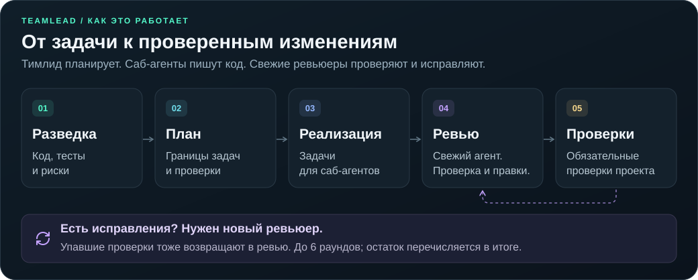

<p align="center">
  
</p>

<h1 align="center">teamlead</h1>

<p align="center">
  <strong>Планирование. Делегирование. Независимое ревью.</strong><br>
  Один навык для Codex и Claude Code.
</p>

<p align="center">
  <a href="README.md"></a>
</p>

<p align="center">
  <a href="skills/teamlead/references/codex/workflow.md"></a>
  <a href="skills/teamlead/references/claude/workflow.md"></a>
  <a href="#установка"></a>
</p>

<p align="center">
  <a href="#установка">Установка</a> &nbsp;·&nbsp;
  <a href="#как-это-работает">Как это работает</a> &nbsp;·&nbsp;
  <a href="#использование">Использование</a> &nbsp;·&nbsp;
  <a href="#модели-codex">Модели Codex</a> &nbsp;·&nbsp;
  <a href="#модели-claude-code">Модели Claude Code</a>
</p>

---

Дайте Teamlead задачу. Тимлид изучит код, составит план и распределит работу между саб-агентами. Свежие ревьюеры проверят и исправят изменения; в конце тимлид запустит обязательные проверки проекта и отчитается о фактическом результате.

## Установка

Нужны Git и Node.js 22.20 или новее с npm. Запустите в терминале:

```sh
npx skills add BorzDev/teamlead
```

**Приложения → Global / Project → установка.** Мастер включает группу `Universal` с Codex; при необходимости отметьте также Claude Code.

<details>
<summary><strong>Как работает мастер установки</strong></summary>

Мастер [Skills CLI](https://github.com/vercel-labs/skills) проведёт через установку:

1. Найдёт единственный навык `teamlead` и выберет его автоматически.
2. Автоматически включает приложения `Universal`, в том числе Codex. Добавьте Claude Code пробелом и подтвердите Enter. Если обнаружено только одно приложение, этот шаг может пропускаться.
3. Предложит `Project` — только текущий проект, или `Global` — все проекты пользователя.
4. При необходимости предложит `Symlink / Copy`, затем покажет итог для подтверждения.

Для установки в проект запускайте команду из его корня. Вход в GitHub и ручное клонирование не нужны. Профиль выбирается при запуске навыка, поэтому обе среды можно отметить за одну установку.

Для установки только в Claude Code укажите приложение явно:

```sh
npx skills add BorzDev/teamlead -a claude-code
```

| Среда | Global (путь по умолчанию) | Project | Вызов |
| --- | --- | --- | --- |
| Codex | `~/.agents/skills/teamlead/` | `.agents/skills/teamlead/` | `$teamlead <задача>` |
| Claude Code | `~/.claude/skills/teamlead/` | `.claude/skills/teamlead/` | `/teamlead <задача>` |

В режиме Symlink приложения используют общую копию навыка. Список приложений задаёт Skills CLI; этот навык содержит рабочие профили для Codex и Claude Code.

</details>

## Как это работает

<p align="center">
  
</p>

| Этап | Что происходит |
| --- | --- |
| **01 · Разведка** | Разведчик находит нужный код, тесты и риски. Тимлид изучает результат и сохраняет исходное состояние Git. |
| **02 · План** | Тимлид задаёт цель, владельцев файлов, интерфейсы и проверки для каждой подзадачи. Режим «только план» заканчивается здесь. |
| **03 · Реализация** | Саб-агенты выполняют задания и запускают адресные проверки. Параллельно идёт только работа без пересечения файлов и ресурсов. |
| **04 · Ревью и правки** | Свежий ревьюер проверяет изменения и сам исправляет реальные дефекты. После раунда с исправлениями приходит следующий свежий ревьюер. |
| **05 · Проверки** | После чистого ревью последовательно запускаются обязательные проверки проекта. Упавшая проверка возвращает работу в ревью и исправление. |

**Понятное условие завершения:** нужен раунд с нулём находок и вердиктом `ready`. Предел — шесть раундов; незавершённые проверки и открытые проблемы явно перечисляются в итоге.

**Проверяемая история работы:** план, решения, отчёты исполнителей и ревью сохраняются вне репозитория, отдельно для каждого checkout и запуска. Итог содержит изменения, раунды ревью, фактические результаты проверок и остаток. Сохранённое состояние помогает продолжить работу после сжатия контекста.

## Использование

Одна точка входа, два профиля. Teamlead использует инструменты и модели текущей сессии Codex или Claude Code.

Запускайте конвейер в Git-проекте с хотя бы одним коммитом: профили используют `HEAD` для исходного снимка.

**Codex:** выберите **Astra / Ultra** в основной сессии и отправьте:

```text
$teamlead Добавь поиск с фильтрами и проверь результат
```

**Claude Code:** выберите **Fable 5.1 / max** в основной сессии и отправьте:

```text
/teamlead Добавь поиск с фильтрами и проверь результат
```

Чтобы начать новую сессию в терминале с этой моделью и effort:

```sh
claude --model claude-fable-5-1 --effort max
```

Чтобы получить только план, добавьте к задаче `только план`.

### Модели Codex

| Роль | Модель | Effort |
| --- | --- | --- |
| Тимлид: планирование и решения | `gpt-6-astra` | `ultra` |
| Основная реализация | `gpt-5.6-terra` | `high` |
| Независимое ревью | `gpt-5.6-sol` | `high` |
| Узкий поиск и простые правки | `gpt-5.6-luna` | `medium` |
| Деньги, авторизация, сложные миграции, конкурентные изменения | `gpt-5.6-sol` | `xhigh` |

Нужна среда Codex с инструментами `collaboration` и выбором модели/effort для саб-агентов. Навык сам не переключает модель основной сессии. Полные правила — в [профиле Codex](skills/teamlead/references/codex/workflow.md).

### Модели Claude Code

Нужны **Claude Code 2.1.267+**, **включённые Dynamic workflows**, доступ к **Fable 5.1** и поддержка провайдером запрашиваемых уровней effort для Fable и Opus, включая Opus `xhigh`. На Pro может потребоваться самостоятельно включить Dynamic workflows в `/config`. Подробнее — в [официальной документации Workflow](https://code.claude.com/docs/en/workflows).

| Роль | Модель | Effort |
| --- | --- | --- |
| Тимлид: планирование и решения | `claude-fable-5-1` | `max` |
| Узкий поиск и простые правки | `opus` | `medium` |
| Разведка незнакомого кода | `opus` | `high` |
| Основная реализация | `opus` | `high` |
| Независимое ревью и исправления | `opus` | `high` |
| Деньги, авторизация, сложные миграции, конкурентные изменения — реализация и ревью | `opus` | `xhigh` |
| Запуск уже заданных команд проверки | `opus` | `low` |
| Эскалация отдельной подзадачи | `claude-fable-5-1` | `max` |

Модель и effort тимлида выбирайте самостоятельно. Навык не переключает основную сессию и не меняет настройки. Все саб-агенты запускаются через native `Workflow` с явным вызовом `agent(prompt, { model, effort })` по настройкам роли. Если `Workflow` недоступен, профиль останавливается до разведки и сообщает причину; перехода на `Agent` с наследуемым effort нет.

В таблице указаны запрашиваемые уровни effort. Ограничения модели и провайдера, лимиты среды и переменные окружения могут повлиять на них. Профиль сообщает о недоступных уровнях или переопределениях и не выдаёт запрошенную настройку за фактически применённую. Подробнее: [уровни effort в Claude Code](https://code.claude.com/docs/en/model-config#adjust-effort-level).

[Шаблон запуска агентов](skills/teamlead/references/claude/agents-workflow.md) обслуживает разведку, реализацию и запуск проверок. [Шаблон ревью](skills/teamlead/references/claude/review-workflow.md) запускает одного свежего ревьюера за вызов Workflow с нужным effort. Перед следующим раундом тимлид читает отчёт и обновляет состояние Git; общий предел — шесть раундов. Оба шаблона входят в тот же навык: отдельная регистрация агентов или установщик не нужны. Полные правила: [профиль Claude Code](skills/teamlead/references/claude/workflow.md).

После установки начните новую сессию Claude Code. Codex обнаруживает изменения навыков автоматически; если навык не появился, перезапустите приложение. Вызов навыка явный в обеих средах.

## Обновление и прежние версии

Повторите команду установки и выберите нужные приложения и область. Сначала сохраните локальные правки: CLI заменяет файлы уже установленного `teamlead`, включая старую Claude-версию с этим именем.

Прежние `teamlead-codex` и `teamlead-claude` автоматически не удаляются. Новая общая команда — `$teamlead` в Codex и `/teamlead` в Claude Code.

## Структура

```text
skills/teamlead/
  SKILL.md
  agents/openai.yaml
  references/
    state.md
    codex/
      workflow.md
      briefs.md
    claude/
      workflow.md
      briefs.md
      agents-workflow.md
      review-workflow.md
```

Пути к материалам определяются из текущей установки, поэтому профили работают как с Global, так и с Project. Рабочие отчёты создаются вне проектов, в отдельной папке для каждого checkout и запуска: Codex — в `${CODEX_HOME:-$HOME/.codex}/teamlead/`, Claude Code — в `~/.claude/teamlead/`.

<details>
<summary><strong>Проверка шаблонов Workflow</strong></summary>

Из клона репозитория запустите `node --test tests/*.test.mjs`. Тесты исполняют встроенные JavaScript-шаблоны с имитацией ответов агентов: проверяют назначение моделей, разрешения, сбои и лимиты ревью. Они не обращаются к реальным моделям и не меняют установленные навыки.

</details>
